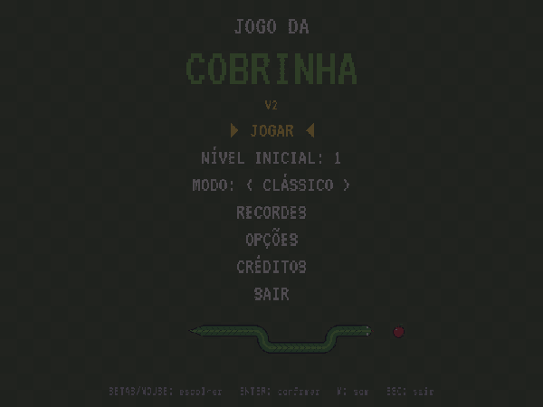

# Jogo da Cobrinha — V2 🐍

[](https://github.com/Joaofernandes-DEV/v2_jogoCobrinha/actions/workflows/ci.yml)
[](https://github.com/Joaofernandes-DEV/v2_jogoCobrinha/releases/latest)

Reescrita completa do [Jogo da Cobrinha (V1)](https://github.com/Joaofernandes-DEV/Py_JogoDaCobrinha), feito em Python + Pygame na disciplina de Computação Gráfica (UNIP).



## Baixar e jogar (Windows)

1. Baixe o **`Cobrinha.exe`** da [última release](https://github.com/Joaofernandes-DEV/v2_jogoCobrinha/releases/latest).
2. Dê dois cliques. Não precisa instalar Python.
3. Se o Windows mostrar "O Windows protegeu o computador" (SmartScreen), clique em **Mais informações → Executar assim mesmo**. O aviso aparece porque o executável não tem assinatura digital paga.

## O que muda na V2

- Código modular: regras do jogo separadas da interface, com testes automatizados.
- Arte nova e coesa em **pixel art**, grade de 32 × 22 células e HUD próprio.
- Menus navegáveis por teclado e mouse, pausa, recordes, sons e dois modos de jogo.
- Correção dos bugs da V1 (fechamento com erro, grade desalinhada, meia-volta suicida etc.).

## Novidades da V3 (em desenvolvimento)

A V3 continua a partir da V2, com o mesmo nome e o mesmo movimento célula a célula. A versão publicada para download ainda é a `v2.0.0`; as novidades abaixo já estão no código-fonte.

**Power-ups:** às vezes um aparece depois de comer. Ele fica no campo por 7 segundos (pisca antes de sumir) e, ao ser pego, não dá pontos nem faz crescer, só aplica o efeito.

| Item | Power-up | Efeito |
|:----:|----------|--------|
|  | **Câmera lenta** | A cobra anda na metade da velocidade por 5 s, e o campo fica azulado. |
|  | **Pontos em dobro** | Por 8 s, cada maçã vale 2 pontos e a maçã dourada vale 10. A meta do nível continua contando 1 por maçã. |
|  | **Encolher** | A cauda perde 3 segmentos na hora, sem a cobra ficar menor que o tamanho inicial. |

- Os efeitos ativos aparecem no HUD com os segundos restantes (ex.: `LENTO 4  X2 7`).
- Pegar de novo um efeito que já está ativo renova a duração. Os efeitos param na pausa e acabam ao trocar de nível.
- Sprites e som dos power-ups são gerados por código, como o resto dos assets (`ferramentas/gerar_sprites.py` e `ferramentas/gerar_sons.py`).

**Em breve:** modo **Contra o tempo**, feito pelo colaborador João Pedro Sinhorini Silva.

## Rodar pelo código-fonte

Pré-requisito: [Python 3.11+](https://www.python.org/downloads/).

```bash
git clone https://github.com/Joaofernandes-DEV/v2_jogoCobrinha.git
cd v2_jogoCobrinha
python -m venv .venv
```

Ative o ambiente virtual (Windows: `.venv\Scripts\activate`; Linux/macOS: `source .venv/bin/activate`), instale e rode:

```bash
pip install -e ".[dev]"
python -m cobrinha
```

### Controles

| Tecla | Ação |
|-------|------|
| Setas ou `W` `A` `S` `D` | Mover a cobra; navegar nos menus |
| `←` `→` | Escolher o nível inicial no menu |
| `Enter` / `Espaço` / clique | Confirmar; pular a contagem 3-2-1 |
| Mouse | Escolher e clicar nas opções dos menus |
| `Esc` ou `P` | Pausar / continuar |
| `M` | Ligar / desligar o som |
| `Esc` no menu principal | Sair |

O jogo também pausa sozinho quando a janela perde o foco.

### Como jogar

Coma a quantidade de comidas da meta (barra no HUD) para concluir o nível. Os pontos se acumulam entre os níveis, e zerar o nível 3 (ou encher o campo) vence o jogo.

| Nível | Nome | Novidade |
|-------|------|----------|
| 1 | Campo aberto | Sem obstáculos |
| 2 | Pedras no caminho | Pedras espalhadas pelo campo |
| 3 | Labirinto | Paredes formando corredores |

- **A cobra acelera** um pouco a cada maçã, e cada nível começa mais rápido que o anterior.
- **Maçã dourada:** às vezes aparece depois de comer. Vale **+5 pontos**, faz crescer, não conta para a meta e **some em 5 segundos** (pisca antes de sumir).
- **Power-ups (V3):** câmera lenta, pontos em dobro e encolher. Veja a tabela em [Novidades da V3](#novidades-da-v3-em-desenvolvimento).
- **Modos de jogo** (escolha no menu): **Clássico**, em que bater na borda perde, e **Sem bordas**, em que a cobra atravessa a borda e sai do outro lado. Pedras e o próprio corpo continuam valendo.
- **Recordes:** os 5 melhores de cada modo ficam salvos, e os níveis alcançados ficam liberados no menu.
- **Opções:** volume dos efeitos e da música, tela cheia e efeitos visuais (desligue para tirar o pisca-pisca e os textos de pontos).
- **Música:** o menu tem a própria música, e cada fase tem uma diferente (dó maior alegre, ré menor sincopada, mi menor rápida). Ao bater, a música para na hora e só volta no menu.

Os dados ficam em `%APPDATA%\Cobrinha\dados.json` no Windows (ou `~/.local/share/cobrinha/` no Linux/macOS).

### Opções de linha de comando

```bash
python -m cobrinha --debug        # mostra FPS e tamanho da cobra
python -m cobrinha --semente 42   # repete exatamente a mesma sequência de comidas
python -m cobrinha --nivel 3      # pula o menu e começa direto no nível 3
python -m cobrinha --fechar-em 5  # fecha sozinho depois de 5 s (teste automático)
```

## Desenvolvimento

```bash
ruff check .            # lint
ruff format .           # formatação
pytest                  # testes (rodam sem abrir janela)
```

Sprites e sons são gerados por código. Para recriá-los (o resultado é sempre o mesmo):

```bash
python ferramentas/gerar_sprites.py   # PNGs 25 × 25 em src/cobrinha/assets/imagens/
python ferramentas/gerar_sons.py      # WAVs em src/cobrinha/assets/sons/
```

Executável e GIF de demonstração (precisam de `pip install -e ".[ferramentas]"`):

```bash
python ferramentas/empacotar.py       # dist/Cobrinha.exe, já testado ao final
python ferramentas/gravar_demo.py     # docs/demo.gif, jogado por um piloto automático (com power-ups)
```

**Publicar uma versão:** basta criar e enviar uma tag (ex.: `git tag v2.0.1 && git push origin v2.0.1`). O workflow `release.yml` roda os testes no Windows, gera e testa o executável e cria a release com ele anexado.

O GitHub Actions roda lint e testes a cada push (Linux com Python 3.11–3.13 e Windows com 3.11).

## Estrutura

```plaintext
src/cobrinha/
├── __main__.py      # ponto de entrada (python -m cobrinha)
├── config.py        # grade, janela, FPS e paleta de cores
├── jogo.py          # loop principal e pilha de estados (telas)
├── recursos.py      # carregamento único de fontes e imagens
├── audio.py         # efeitos, música e mudo
├── assets/          # fonte, sprites (PNG) e sons (WAV)
├── dominio/         # regras puras, sem pygame (testáveis)
│   ├── grade.py     #   Posicao, Direcao e Grade
│   ├── cobra.py     #   corpo, movimento, crescimento e fila de direções
│   ├── comida.py    #   sorteio entre as células livres
│   ├── niveis.py    #   níveis como dados (velocidade, meta e mapa de pedras)
│   ├── progresso.py #   ranking por modo e níveis liberados
│   ├── power_ups.py #   tipos de power-up e duração dos efeitos
│   └── partida.py   #   passo fixo, modos, colisões, fruta dourada, vitória e derrota
├── opcoes.py        # preferências do jogador
├── persistencia.py  # leitura/gravação do JSON de dados
├── estados/         # telas: menu, recordes, opções, créditos, contagem, jogo, pausa, fim
│   └── navegacao.py #   mapa de todas as trocas de tela
└── ui/              # HUD, campo, sprites, menu, painéis, efeitos e texto
ferramentas/         # geradores de sprites e sons, empacotador e gravador do GIF
docs/                # GIF de demonstração e notas das releases
tests/               # pytest
```

## Documentos do projeto

| Arquivo | Conteúdo |
|---------|----------|
| [briefing_v2.md](briefing_v2.md) | Diagnóstico da V1, decisões e plano de melhorias em fases |
| [LOG.md](LOG.md) | Diário de bordo com todas as alterações, por data e horário |

## Tecnologias

Python 3.11+ · [pygame-ce](https://pyga.me/) · pytest · ruff · GitHub Actions

## Créditos

- **V2:** João Vitor Fernandes e, como colaborador, João Pedro Sinhorini Silva.
- **V1 (2025), Computação Gráfica:** João Vitor Fernandes, João Pedro Sinhorini Silva, Vitor Barssoti de Souza e Alex Barbosa Lourenço.
- **Fonte:** [VT323](https://fonts.google.com/specimen/VT323), de Peter Hull, sob a [SIL Open Font License 1.1](src/cobrinha/assets/fontes/OFL.txt).
- **Sprites e sons:** gerados por código neste repositório.

## Licença

Código sob a [MIT](LICENSE) © João Vitor Fernandes. A fonte VT323 mantém a própria licença (SIL OFL 1.1).
